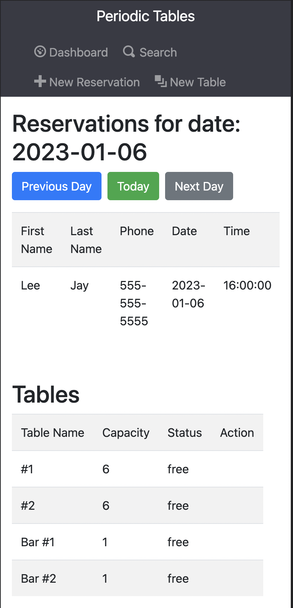
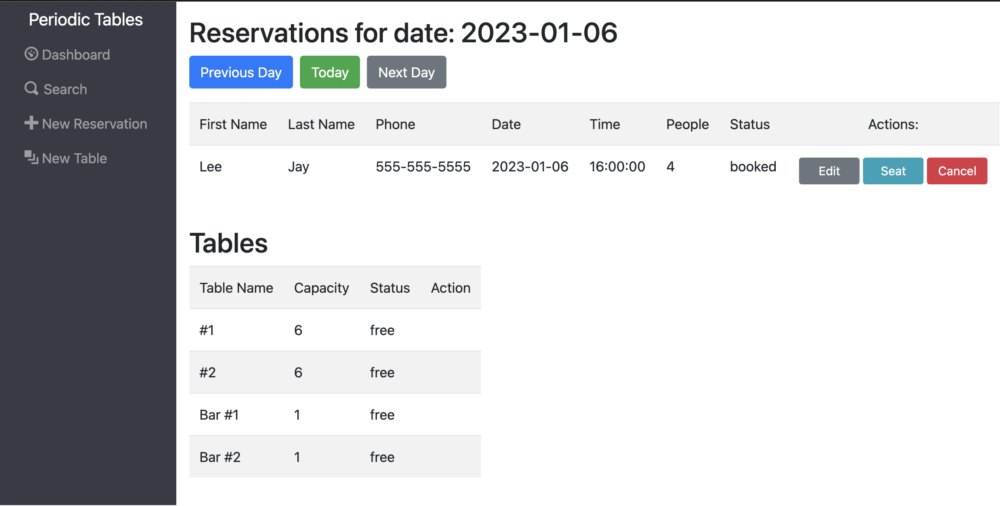

# Capstone: Restaurant Reservation System

> This is a reservation system for the startup and fine dining restaurant, _Periodic Tables_.
> The software is used only by restaurant personnel when a customer calls to request a reservation.
 

### Application Link: [Periodic Tables](https://capstonereservationfrontend.onrender.com)

 
 

## API Description

The tables below describe the api capabilities in this repository:

| Path/Method | Description                                                      |
| ---------------- | ---------------------------------------------------------------- |
| `/reservations`     | Allows Methods GET, POST, PUT |
| `GET`    | API calls with this method is used to list reservations and read reservations by providing a reservation id (/:reservationId). Adding query parameters date=YYYY-MM-DD/mobile_number=800-555-1212, returns reservations by date provided, not including finished and cancelled reservations sorted by time, and reservations matching the mobile number including finished and cancelled reservations respectively. |
| `POST`    | API calls with this method is used to create new reservations |
| `PUT`    | API calls with this method is used to update reservation details when status is booked. After the status is booked, only updates are to the status from seated to finished. |

 

| Path/Method | Description                                                      |
| ---------------- | ---------------------------------------------------------------- |
| `/tables`    | Allows Methods GET, POST, PUT, DELETE |
| `GET`    | API calls with this method is used to list tables and read tables by providing a table id (/:tableId).|
| `POST`    | API calls with this method is used to create new tables. |
| `PUT`    | API calls with this method is used to add a reservation id to denote that a table is occupied and updates reservation to status seated. |
| `DELETE`    | API calls with this method is used to remove a reservation id to denote that a table is free and updates the reservation to status finished.

 

 

## Screenshots

### Mobile View

### Desktop View

 
 

## Summary of Application Capabilities

The restaurant manager has the following capabilities within the application:
* Create a new reservation when a customer calls so that they know how many customers will arrive at the restaurant on a given day.

* Only allow reservations to be created on a day when the restaurant is open so that users do not accidentally create a reservation for days when the restaurant is closed.

* Only allow reservations to be created during business hours, up to 60 minutes before closing so that users do not accidentally create a reservation for a time the restaurant cannot accommodate.

* When a customer with an existing reservation arrives at the restaurant, seat (assign) their reservation to a specific table so the restaurant knows which tables are occupied and free.

* Free up an occupied table when the guests leave so that the restaurant can seat new guests at that table.

* Reservations have a status of either booked, seated, or finished so that the restaurant can see which reservation parties are seated, and finished reservations are hidden from the dashboard.

* Search for a reservation by phone number (partial or complete) so that the restaurant can quickly access a customer's reservation when they call about their reservation.

* Modify a reservation if a customer calls to change or cancel their reservation so that reservations are accurate and current.

 
 

## Technology Used

This is a full-stack app using React.js, CSS (Bootstrap), Node.js, Express, and PostgreSQL.

## Installation

1. Fork and clone this repository.
1. Run `cp ./back-end/.env.sample ./back-end/.env`.
1. Update the `./back-end/.env` file with the connection URL's to your ElephantSQL database instance.
1. Run `cp ./front-end/.env.sample ./front-end/.env`.
1. You should not need to make changes to the `./front-end/.env` file unless you want to connect to a backend at a location other than `http://localhost:5001`.
1. Run `npm install` to install project dependencies.
1. Run `npm run start:dev` to start your server in development mode.
